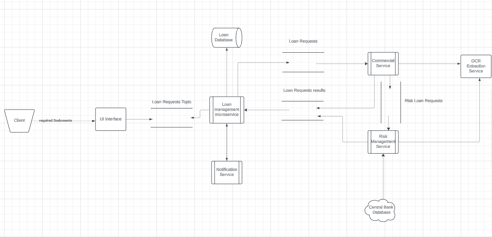
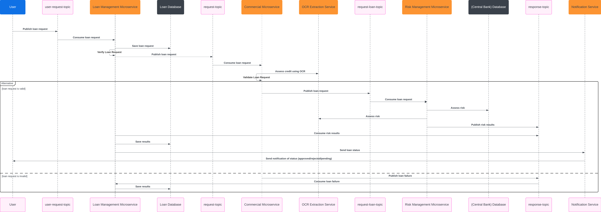

# Loan Validation Application :
This a demo loan application that implements a reactive microservices architecture:

# Architecture :


#### Microservices:
  * Loan Management Microservice: Responsible for processing loan requests, validating data, and storing information in the “Loan Database.”
  * Risk Management Microservice: Assesses risk associated with loan requests. It accesses data from the “(Central Bank) Database” and the “OCR Extraction Service.”
  * Notification Service: Sends notifications to clients regarding loan request status (approved, rejected, pending).
  * Commercial Service: Receives loan requests for risk assessment.
  * OCR Extraction Service:
    Optical Character Recognition (OCR) technology extracts text from images or scanned documents.
    The OCR Extraction Service likely processes documents submitted by borrowers to extract relevant data for risk assessment.
#### Kafka Topics:
  Kafka topics act as communication channels between microservices.
  The “user-request-topic” allows the User to publish loan requests, which are then consumed by the Loan Management Microservice.
  The "request-topic" allows the Loan Management Microservice to publish loan requests, which are then consumed by the Commercial Microservice.
  The "request-loan-topic" allows the Risk Management Microservice to publish loan requests, which are then consumed by the Risk Management Service.
  The “response-topic” allows the Risk Management Microservice or the Commercial Microservice to publish risk assessment results, which are then consumed by the Loan Management Microservice. 
#### REST API:
  * The REST API serves as the bridge between the Loan Management Microservice and the Notification Microservice.
    The Loan Management Microservice sends loan request status updates to the Notification Microservice via REST API.
  * Moreover the REST API links the Risk Management Microservice and the Commercial Microservice to the OCR Extraction Service.
    The OCR Extraction Service expose an api endpoint to receive requests from the Risk Management Microservice and the Commercial microservice.
#### Databases (Unimplemented):
  The “Loan Database” stores loan request information processed by the Loan Management Microservice.
  The “(Central Bank) Database” contains relevant data for risk assessment.

# Workflow :

1. The User submits a loan request to the User Interface ( In this case we use send-request.sh ).
2. The User Interface publishes the loan request to the “user-request-topic.”
3. The Loan Management Microservice consumes the loan request from the “user-request-topic.”
4. The Loan Management Microservice processes the loan request, validates the data, and stores the information in the “Loan Database.”
5. The Loan Management Microservice publishes the loan request to the “request-topic.”
6. The Commercial Microservice consumes the loan request from the “request-topic.” and Asseses its credability using OCR Extraction Service.
7. The Commercial Microservice publishes the loan request to the “request-loan-topic” if the loan request is valid else it publishes the loan failure response to the “response-topic.”
8. In case the request loan is validated by the Commercial Microservice , The Risk Management Microservice consumes the loan request from the “request-loan-topic.”
9. The Risk Management Microservice assesses the risk associated with the loan request by accessing data from the “(Central Bank) Database” and the “OCR Extraction Service.”
10. The Risk Management Microservice publishes the risk assessment results to the “response-topic.”
11. The Loan Management Microservice consumes the risk assessment results from the “response-topic.”
12. The Loan Management Microservice analyze the results , save them in the “Loan Database” and send the status to the Notification Service.
13. The Notification Service sends notifications to the User Interface regarding the loan request status (approved, rejected, pending).
14. The User Interface displays the loan request status to the User.

# How to run the application :
1. Clone the repository.
2. Run the following command to start the containers:
    ```bash
    docker-compose up
    ```
3. Run the following command to create the kafka topics:
    ```bash
    bash create-topics.sh
    ```
4. Run the following command to send a loan request:
    ```bash
    bash send-request.sh
    ```
5. Follow the logs to see the workflow:
    ```bash
    docker-compose logs -f
    ```
   
# Technologies Used :
  * Go : For the implementation of the microservices.
  * Goroutines : For the concurrency.
  * Kafka : For the communication between the microservices.
  * Gin : For the REST API.
  * Docker : For containerization.
  * Docker-Compose : For the orchestration of the containers.
  * Bash : For the automation of the process.